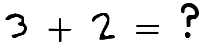
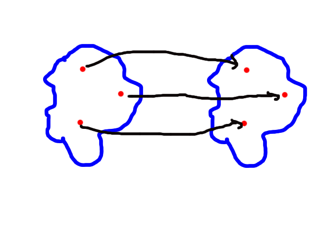

## Introduction


---

## Some Maths

### Category Theory

* mathematical abstraction
* categories are sets, vector spaces, or types for computer science..



---

### Category Theory 2

* there are mappings between them: an object can be "transferred" from one category to another
* mappings are structure preservent



---

## So what are functors?

Structure preservent mappings between categories!

---

## The Haskell Definition

"Types that can act like a box can be functors. You can think of a list as a box that can be empty or have something inside it, including another box!"


Attribution http://adit.io

---

## The Haskell Definition 2

Functor is a type class. Very much like Eq, Ord, Show, ...
It requires a type constructor that takes __one__ parameter

```
    class  Functor    f   where
    fmap         ::   (a -> b) -> f a -> f b
```


Attribution http://adit.io

---

## An Example - Lists

```
     map :: (a -> b) -> [a] -> [b]
     instance Functor [] where
        fmap = map
```


Attribution http://adit.io

---

## Demo!

```
   > fmap (2 +) [1,2,3]
```

---

## You already know this!

### Ruby

```
> [1, 2, 3].map { |n| n * n};

=> [1, 4, 9]
```

---

## You already know this!

### Javascript

```
>  _.map([1, 2, 3], function(num){return num*3;});

=> [3, 6, 9]
```

---

## From a functor to another functor

### Tree vs Array


[1, 3, 4, 6, 7, 8, 10, 13, 14]

Attribution https://en.wikipedia.org/wiki/File:Binary_search_tree.svg

---

## The Natural Transformation

```
              alpha
      F(A) ----------> G(A)
        |               |
        |               |
fmap f  |               | fmap f
        |               |
        |               |
        v               v
      F(B) ----------> G(B)
              alpha
```

---

## The end

### Thanks!

### Questions?

---

## Some Sources

* http://learnyouahaskell.com/
* http://adit.io/posts/2013-04-17-functors,applicatives,_and_monads_in_pictures.html
* https://en.wikipedia.org/wiki/Category_theory

